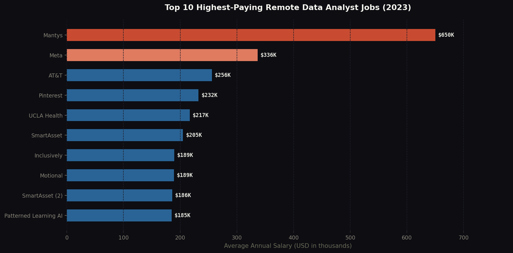
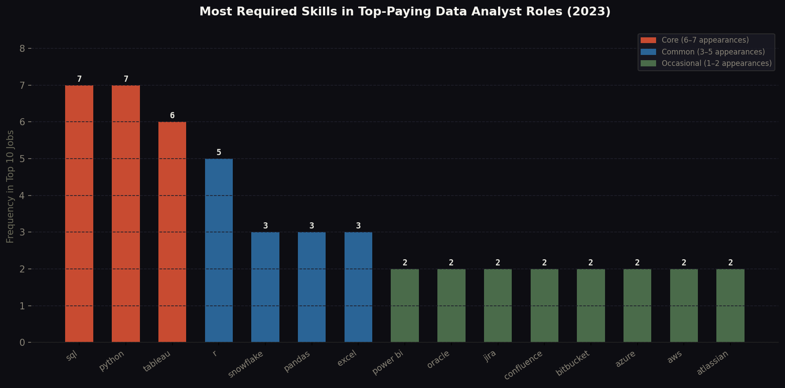
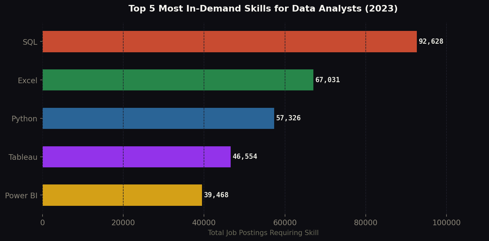
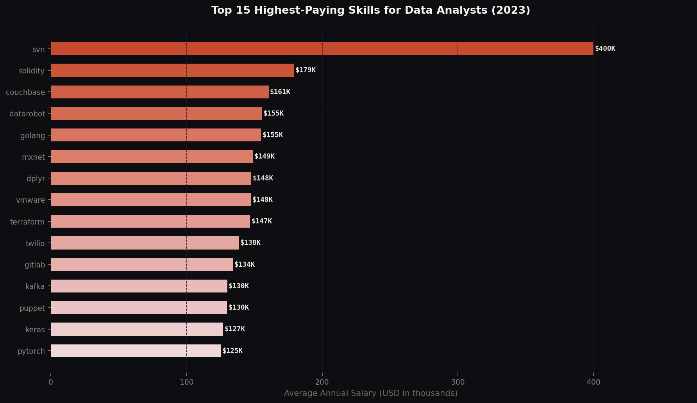
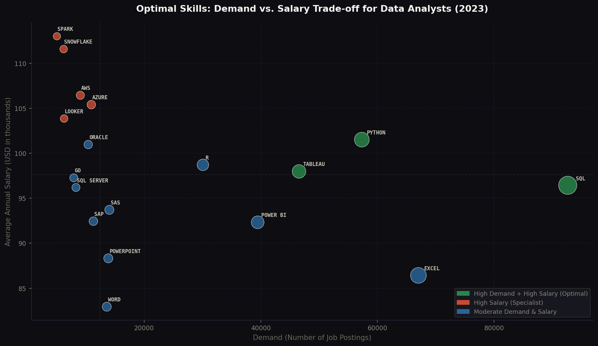

# 📊 SQL Job Market Analysis


> *A data-driven exploration of the 2023 job market — uncovering where the highest salaries live, which skills employers actually want, and what an aspiring data analyst should learn first to maximize both opportunity and earning potential.*

🔗 **[View Live Dashboard →](https://sai-krupa-chintala.github.io/SQL_Job_Market_Analysis_Portfolio/)**

---

## 📌 Table of Contents

1. [Introduction](#introduction)
2. [Background](#background)
3. [Tools Used](#tools-used)
4. [How I Used the Tools](#how-i-used-the-tools)
5. [Analysis](#analysis)
   - [Query 1 — Top Paying Jobs](#query-1--top-paying-data-analyst-jobs)
   - [Query 2 — Skills for Top Paying Jobs](#query-2--skills-behind-top-paying-jobs)
   - [Query 3 — Most In-Demand Skills](#query-3--most-in-demand-skills)
   - [Query 4 — Top Paying Skills](#query-4--top-paying-skills-by-salary)
   - [Query 5 — Most Optimal Skills](#query-5--most-optimal-skills-to-learn)
6. [What I Learned](#what-i-learned)
7. [Insights](#insights)
8. [Conclusion](#conclusion)

---

## Introduction

This project is an end-to-end SQL analysis of the 2023 data analyst job market. Using a real-world dataset of job postings, I wrote **five structured SQL queries**  progressing from basic `SELECT` statements to multi-CTE joins — to answer one central question:

> **What skills should an aspiring data analyst prioritize to maximize both employability and earning potential?**

The project demonstrates practical SQL fluency across filtering, aggregation, window functions, CTEs, and multi-table joins all applied to a real business problem.

---

## Background

### The Scenario
As someone actively transitioning into a data analyst role, I wanted evidence-based answers rather than generic career advice. Instead of asking "what should I learn?", I let the data answer it directly.

### The Data
The dataset was sourced from trusted online source a comprehensive collection of real 2023 job postings scraped from job boards across the globe. It includes:

- `job_postings_fact` — core job postings table (title, salary, location, schedule, WFH status)
- `company_dim` — company names linked by `company_id`
- `skills_dim` — skill names linked by `skill_id`
- `skills_job_dim` — bridge table mapping jobs to required skills

### Questions I Wanted to Answer
1. What are the top-paying remote Data Analyst roles?
2. What skills are required by those top-paying jobs?
3. Which skills appear most frequently across ALL job postings?
4. Which skills are associated with the highest average salaries?
5. Which skills offer the best combination of high demand **and** high pay?

---

## Tools Used

| Tool | Purpose |
|------|---------|
| **PostgreSQL** | Database engine — all queries were written and executed here |
| **VS Code** | Code editor with SQL extensions for writing and organizing queries |
| **Git & GitHub** | Version control and portfolio hosting |
| **GitHub Pages** | Publishing the interactive dashboard as a live website |
| **Python (Matplotlib + Seaborn)** | Generating visualizations for this README |

---

## How I Used the Tools

### PostgreSQL
I used PostgreSQL as the primary analysis engine. Each query built progressively on the last:

- **Query 1** used `WHERE`, `LEFT JOIN`, `ORDER BY`, and `LIMIT` for basic filtered retrieval
- **Query 2** introduced a **CTE** (`WITH`) to reuse the top-paying jobs result and join it with the skills tables
- **Query 3** used `COUNT(*)` with `GROUP BY` and `INNER JOIN` to aggregate skill frequency
- **Query 4** combined `AVG()` with `ROUND()` inside a CTE to calculate average salary per skill
- **Query 5** used **two CTEs** — one for salary, one for demand — joined together to rank skills on both dimensions simultaneously

### VS Code
Each query was saved as a separate `.sql` file, organized in a project folder with clear naming (`query_1.sql` through `query_5.sql`). The SQLTools extension was used to connect directly to the PostgreSQL database.

### Git & GitHub
Standard git workflow: `init → add → commit → push`. The repo is public so it serves as both version history and portfolio piece.

---

## Analysis

---

### Query 1 — Top Paying Data Analyst Jobs

**💡 Insight: The salary ceiling is $650K, but the realistic top tier is $185K–$255K**

The top 10 remote Data Analyst roles in 2023 showed a dramatic salary spread — from $185K at Patterned Learning AI all the way to $650K at Mantys. Mantys and Meta are clear outliers. Strip those two out and the realistic top-tier range sits at $185K–$255K. Every single role is fully remote and full-time, confirming that the highest-paying opportunities have fully embraced remote work. Companies like AT&T, Pinterest, SmartAsset, and UCLA Health make up the rest — spanning tech, finance, and healthcare

```sql
SELECT
    job_id,
    job_title_short AS job_title,
    company.name AS company_name,
    job_location,
    job_schedule_type,
    job_posted_date,
    ROUND(salary_year_avg, 0) AS salary,
    CASE
        WHEN job_work_from_home = TRUE THEN 'remote'
        ELSE 'on_site'
    END AS job_type
FROM
    job_postings_fact AS job_postings
LEFT JOIN
    company_dim AS company
    ON job_postings.company_id = company.company_id
WHERE
    job_title_short LIKE '%Data Analyst%'
    AND job_work_from_home = TRUE
    AND salary_year_avg IS NOT NULL
ORDER BY
    salary DESC
LIMIT 10;
```



---

### Query 2 — Skills Behind Top Paying Jobs

**💡 Insight: SQL + Python + Tableau is the universal foundation — cloud skills separate the highest earners**

Across all top-paying companies, SQL and Python appeared in 7 out of 8 companies that listed skills. Tableau appeared in 6. What separates the $200K+ roles from the rest is cloud infrastructure: AT&T's $255K role required 13 skills including AWS, Azure, Databricks, and PySpark — signaling that the very top of the market rewards analysts who can operate across the full data engineering stack, not just analysis. Roles with no skills listed (Mantys at $650K, Meta at $336K) likely represent senior/specialized positions where skills are assessed differently.

```sql
WITH top_paying_jobs AS (
    SELECT
        job_id,
        job_title_short AS job_title,
        salary_year_avg AS salary,
        job_location,
        job_posted_date,
        company.name AS company_name
    FROM job_postings_fact
    LEFT JOIN company_dim AS company
        ON job_postings_fact.company_id = company.company_id
    WHERE
        job_work_from_home = TRUE
        AND job_title_short = 'Data Analyst'
        AND salary_year_avg IS NOT NULL
    ORDER BY salary_year_avg DESC
    LIMIT 10
)
SELECT
    tpj.*,
    s_skill.skills AS skill_name
FROM top_paying_jobs AS tpj
LEFT JOIN skills_job_dim AS j_skill
    ON tpj.job_id = j_skill.job_id
LEFT JOIN skills_dim AS s_skill
    ON j_skill.skill_id = s_skill.skill_id
ORDER BY tpj.salary DESC, s_skill.skills;
```



---

### Query 3 — Most In-Demand Skills

**💡 Insight: SQL dominates with 92K postings — nearly 2.3× more than Power BI**

SQL is the undisputed #1 skill at 92,628 job postings. Excel holds #2 at 67K, followed by Python at 57K, Tableau at 46K, and Power BI at 39K. Together these five skills appear in over 343,000 job postings. The message is clear: master these five before anything else. SQL and Excel cover the majority of entry-level requirements, while Python and Tableau unlock mid-to-senior level positions.

```sql
WITH skill_demand AS (
    SELECT
        sj.skill_id,
        j.job_title_short,
        COUNT(*) AS total_skill_count
    FROM job_postings_fact AS j
    INNER JOIN
        skills_job_dim AS sj
        ON j.job_id = sj.job_id
    WHERE
        j.job_title_short ILIKE 'Data Analyst'
    GROUP BY
        sj.skill_id,
        j.job_title_short
)
SELECT
    sd.job_title_short,
    s.skills AS skill_name,
    sd.total_skill_count
FROM
    skill_demand AS sd
INNER JOIN
    skills_dim AS s
    ON sd.skill_id = s.skill_id
ORDER BY
    total_skill_count DESC
LIMIT 5;
```



---

### Query 4 — Top Paying Skills by Salary

**💡 Insight: Niche and specialized skills command extreme premiums — but with very low demand**

SVN tops the list at $400K average, followed by Solidity ($179K) and Couchbase ($160K). These are highly specialized, low-demand skills where supply is scarce. More practically relevant are mid-tier skills like Terraform ($146K), GitLab ($134K), Kafka ($130K), Keras ($127K), and PyTorch ($125K) — which reflect demand for analysts who can work in modern ML/engineering pipelines. Interestingly, foundational skills like SQL ($96K) and Excel ($86K) rank much lower here, confirming the demand-salary tradeoff explored in Query 5.

```sql
WITH skills_in_demand AS (
    SELECT
        j.job_title_short AS job_title,
        sj.skill_id,
        ROUND(AVG(j.salary_year_avg), 0) AS avg_salary,
        COUNT(*) AS total_skill_count
    FROM
        job_postings_fact AS j
    INNER JOIN
        skills_job_dim AS sj
        ON j.job_id = sj.job_id
    WHERE
        j.job_title_short ILIKE 'Data Analyst'
        AND j.salary_year_avg IS NOT NULL
    GROUP BY
        j.job_title_short,
        sj.skill_id
)
SELECT
    sd.job_title,
    s.skills AS most_in_demand_skills,
    sd.avg_salary
FROM
    skills_in_demand AS sd
INNER JOIN
    skills_dim AS s
    ON sd.skill_id = s.skill_id
ORDER BY
    sd.avg_salary DESC;
```



---

### Query 5 — Most Optimal Skills to Learn

**💡 Insight: Python, Tableau, and SQL sit in the sweet spot — high demand AND strong salaries**

This query combined two CTEs — one for salary ranking, one for demand count — to identify skills that score high on both dimensions simultaneously. The results show a clear **optimal zone**: Python (57K postings, $101K avg), Tableau (46K postings, $97K avg), and SQL (92K postings, $96K avg) offer the best balance of job availability and compensation. Cloud skills like Snowflake ($111K), Spark ($113K), AWS ($106K), and Azure ($105K) offer higher salaries with moderate-but-growing demand — the smart "next step" after the core stack.

```sql
WITH highest_paying_skills AS (
    SELECT
        j.job_title_short AS job_title,
        sj.skill_id,
        ROUND(AVG(j.salary_year_avg), 0) AS avg_salary
    FROM
        job_postings_fact AS j
    INNER JOIN
        skills_job_dim AS sj ON j.job_id = sj.job_id
    WHERE
        j.job_title_short ILIKE 'Data Analyst'
        AND j.salary_year_avg IS NOT NULL
    GROUP BY
        j.job_title_short, sj.skill_id
),
skill_demand AS (
    SELECT
        sj.skill_id,
        j.job_title_short,
        COUNT(*) AS demand_count
    FROM job_postings_fact AS j
    INNER JOIN skills_job_dim AS sj ON j.job_id = sj.job_id
    WHERE
        j.job_title_short ILIKE 'Data Analyst'
    GROUP BY
        sj.skill_id, j.job_title_short
)
SELECT
    sd.skill_id,
    s.skills AS skill_name,
    sd.demand_count,
    hps.avg_salary
FROM skill_demand AS sd
INNER JOIN highest_paying_skills AS hps
    ON sd.skill_id = hps.skill_id
    AND sd.job_title_short = hps.job_title
INNER JOIN skills_dim AS s
    ON sd.skill_id = s.skill_id
ORDER BY
    sd.demand_count DESC,
    hps.avg_salary DESC;
```



---

## What I Learned

### SQL Techniques
- **CTEs (`WITH` clause)** — Writing reusable subqueries that make complex logic readable and modular. Query 5 uses two CTEs joined together, which mirrors real production SQL patterns.
- **Multi-table JOINs** — Joining `job_postings_fact` → `company_dim` → `skills_job_dim` → `skills_dim` across four tables to produce meaningful combined results.
- **Conditional aggregation** — Using `CASE WHEN` inside `SELECT` to create derived columns (e.g., classifying jobs as remote vs. on-site).
- **`ILIKE` vs `LIKE`** — Case-insensitive pattern matching for more robust filtering on text fields.
- **`ROUND(AVG(...), 0)`** — Combining aggregate functions with formatting for clean numeric output.

### Analytical Thinking
- Learned to distinguish between **demand** (how often a skill appears) and **value** (what salary it commands) — two entirely different signals that answer different questions.
- Understood that **outliers matter** — Mantys at $650K and SVN at $400K average distort the picture significantly. Identifying and contextualizing outliers is as important as the main analysis.
- Practiced building **progressive analysis** — where each query answers a question raised by the previous one, creating a coherent narrative rather than isolated findings.

---

## Insights

| # | Finding | Actionable Takeaway |
|---|---------|---------------------|
| 1 | Top remote DA salaries range from $185K–$650K | Target companies like AT&T, SmartAsset, and Inclusively for high-paying remote roles |
| 2 | SQL + Python + Tableau appear in 7/8 top-paying companies | These three are non-negotiable foundation skills |
| 3 | SQL has 92K job postings — 2.3× more than Power BI | SQL is the single highest ROI skill to master first |
| 4 | Cloud skills (AWS, Azure, Snowflake) appear at $105K–$111K avg | Cloud is the clear "next level" after the core stack |
| 5 | Niche skills (SVN, Solidity) have extreme salaries but near-zero demand | Chasing niche skills is high risk — broad foundational skills offer more job security |
| 6 | Python sits in the optimal zone: 57K postings + $101K avg salary | Python is the single best "second skill" to add after SQL |

---

## Conclusion

This analysis confirms what the best career advice already suggests — but now with data behind it. **SQL, Python, and Tableau are the core stack** that opens the most doors and pays well. Cloud platforms (AWS, Azure, Snowflake) are the smart progression path that pushes earning potential above $105K. Niche and specialized skills exist in a high-risk, high-reward category that makes sense only once the foundation is solid.

For anyone entering the data analyst field in 2024, the evidence-based learning order is:

```
SQL → Python → Tableau/Power BI → Cloud (AWS/Azure/Snowflake) → Specialization
```

---
*Built with PostgreSQL · Visualized with Python (Matplotlib + Seaborn) · Hosted on GitHub Pages*
